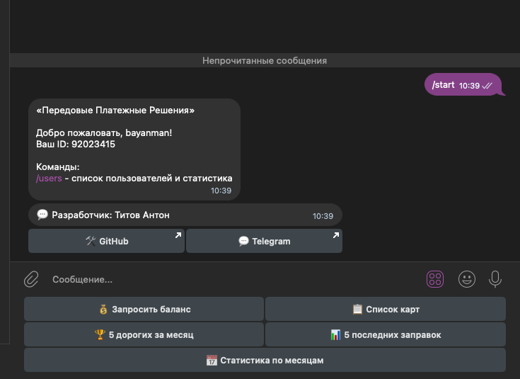

# 🤖 Petroplus-Telegram_bot

Telegram-бот взаимодействует с [API](https://online.petrolplus.ru/api/v1/sdata/api/API_instruction_PPR.pdf) («Передовые Платежные Решения»), чтобы предоставлять пользователям информацию об их топливных картах, балансе и истории транзакций. Он также включает административные функции и задачи фонового мониторинга.

## Основные функции для пользователя (Доступны через команды и кнопки)

1.  **Команда `/start`**
    *   Регистрирует новых пользователей или обновляет имена существующих в локальной базе данных.
    *   Приветствует пользователя.
    *   Отображает основную клавиатуру с доступными действиями.
    *   Предоставляет контактные ссылки разработчика (GitHub, Telegram).
    *   Показывает специфичные команды администратора, если пользователь является администратором.

2.  **Кнопка "💰 Запросить баланс":**
    *   Запрашивает и отображает текущий общий баланс счета из API PetrolPlus.
    *   Получает и отображает подробную статистику расходов за **текущий месяц**, включая:
        *   Общую потраченную сумму.
        *   Диапазон дат (с начала месяца по текущую дату).
        *   Количество заправок.
        *   Общий объем заправленного топлива.
        *   Среднюю стоимость одной заправки.
        *   Среднюю стоимость литра.
        *   Разбивку расходов по типам топлива (сумма и объем).
        *   Топ-3 посещенных АЗС (по количеству заправок и общей сумме).

3.  **Кнопка "📋 Список карт":**
    *   Запрашивает полный список топливных карт из API.
    *   Отображает статистику: общее количество карт, активные карты, заблокированные карты.
    *   Представляет каждую карту в виде инлайн-кнопки, показывая ее статус (🟢 Активна / 🔴 Заблокирована), номер карты и заметку владельца.

4.  **Просмотр деталей карты (Callback из Списка карт):**
    *   Вызывается нажатием на кнопку карты в списке.
    *   Запрашивает подробную информацию по **конкретной карте**, включая:
        *   Номер карты.
        *   Заметку владельца.
        *   Текущий статус (например, "В работе", "Заблокирована").
        *   Дату последнего обновления статуса.
        *   Текущие лимиты, связанные с картой (сгруппированные по типу топлива и услугам), показывая остаток лимита и общий лимит.
        *   Последние 5 транзакций, совершенных по **этой конкретной карте**.
    *   Обновляет существующее сообщение этой информацией.

5.  **Кнопка "🏆 5 дорогих за месяц":**
    *   Запрашивает транзакции за **текущий календарный месяц**.
    *   Находит и отображает 5 транзакций с наибольшей стоимостью.
    *   Для каждой транзакции показывает: тип топлива, общую стоимость, дату, номер карты, владельца, объем, цену за литр, бренд АЗС и адрес.
    *   Включает инлайн-кнопку для просмотра топ-5 транзакций за **предыдущий месяц**.

6.  **Топ транзакций за Предыдущий/Следующий Месяц (Callback):**
    *   Вызывается нажатием на кнопки навигации по месяцам.
    *   Запрашивает и отображает топ-5 самых дорогих транзакций за **выбранный месяц**, аналогично функции "5 дорогих за месяц".
    *   Предоставляет кнопки навигации для перемещения между месяцами.

7.  **Кнопка "📊 5 последних заправок":**
    *   Запрашивает недавние транзакции (по всем картам, например, за последние 30 дней).
    *   Сортирует транзакции по дате (самые новые первыми).
    *   Отображает детали **последних 5 транзакций** независимо от стоимости, включая: тип топлива, стоимость, дату, номер карты, владельца, объем, цену за литр, бренд АЗС и адрес.

8.  **Кнопка "📅 Статистика по месяцам":**
    *   Запрашивает данные о расходах за **каждый месяц текущего года** до настоящего момента.
    *   Отображает сводку по каждому месяцу:
        *   Название месяца.
        *   Общая потраченная сумма.
        *   Количество транзакций.
        *   Общий заправленный объем.
        *   Разбивка по типам топлива (объем, средняя цена, общая стоимость).
    *   Рассчитывает и отображает **итоги за год на текущую дату**: общая сумма, общее количество транзакций, общий объем, средняя стоимость транзакции и средняя стоимость литра.

## Функции Администратора

1.  **Декоратор `@admin_only`:**
    *   Утилита для ограничения доступа к определенным обработчикам команд только для пользователей, чьи ID перечислены в переменной окружения `ADMIN_IDS`.

2.  **Команда `/users` (Только для администраторов):**
    *   Отображает общую статистику бота: общее количество зарегистрированных пользователей, количество администраторов.
    *   Перечисляет всех зарегистрированных пользователей с их именем пользователя, Telegram ID и датой регистрации.

## Фоновые Процессы (Запускаются автоматически)

1.  **`check_new_transactions()` (Проверка новых транзакций):**
    *   Периодически (например, каждые 60 секунд) запрашивает недавние транзакции из API.
    *   Сравнивает их с локальной базой данных уже обработанных транзакций.
    *   Если найдена новая транзакция:
        *   Форматирует подробное сообщение-уведомление (включая владельца карты, тип топлива, объем, стоимость, станцию, адрес, дату).
        *   Отправляет уведомление **всем зарегистрированным пользователям** через `notify_users()`.
        *   Сохраняет идентификатор транзакции в базе данных для предотвращения повторного уведомления.
    *   Периодически удаляет старые записи о транзакциях из локальной базы данных.

2.  **`check_total_balance()` (Проверка общего баланса):**
    *   Периодически (например, каждые 180 секунд) запрашивает общий баланс счета.
    *   Сравнивает текущий баланс с ранее записанным.
    *   Если баланс падает ниже предопределенного порога `BALANCE_THRESHOLD` впервые с момента последней проверки выше порога, отправляет уведомление "Низкий баланс" всем пользователям.
    *   Если баланс увеличивается (указывая на пополнение), отправляет уведомление "Баланс пополнен" всем пользователям, показывая добавленную сумму и новый итог.
    *   Сохраняет текущий баланс и время проверки в базе данных.

## Внутренние Компоненты

*   **Класс `DatabaseManager`:** Обрабатывает все взаимодействия с базой данных SQLite (`users.db`) для хранения информации о пользователях, ID обработанных транзакций и истории баланса. Включает обработку ошибок и логику переподключения.
*   **Класс `APIClient`:** Управляет связью с API PetrolPlus, обрабатывая заголовки запросов (включая API-ключ и XSRF-токен из переменных окружения), сессии и базовую обработку ошибок.
*   **Вспомогательные функции API:** (`get_cards_list`, `get_card_limits`, `get_last_transactions`, `get_total_balance`, `get_monthly_expenses`, `get_expenses_for_period`): Абстрагируют прямые вызовы к `APIClient` для конкретных задач получения данных.
*   **`format_transaction_message()`:** Вспомогательная функция для создания текста уведомлений о новых транзакциях.
*   **`notify_users()`:** Вспомогательная функция для рассылки сообщений всем пользователям, хранящимся в базе данных.
*   **Логирование:** Использует модуль `logging` для записи информации, предупреждений и ошибок во время работы.
*   **Переменные окружения:** Зависит от файла `.env` (или системных переменных окружения) для хранения конфиденциальной информации, такой как ключи API и ID администраторов.

## 💳 Демонстрация и оплата

- Решение платное
- [🔗 Запросить демонстрацию и узнать цену](https://github.com/bayanist)

## Требования

-   **Язык:** Python 3
-   **Библиотека Telegram:** aiogram 3.x
-   **HTTP-запросы:** requests
-   **База данных:** SQLite 3 (через `sqlite3`)
-   **Переменные окружения:** python-dotenv
